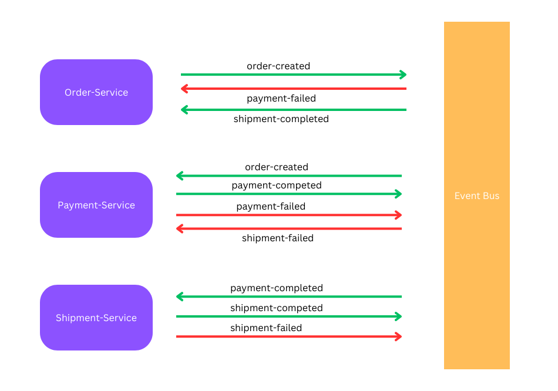

# saga-choreography-demo

### Order Creation Transaction Workflow

- Happy path: order-created(status: CREATED) -> payment-completed -> shipment-completed = order status is COMPLETED

- Payment failure: order-created -> payment-failed = order status is FAILED

- Shipment failure: order-created -> payment-completed -> shipment-failed -> payment-failed = Rollback payment: delete transaction and reset back user balance | order status is FAILED

#### Tests cases
- Happy path use userId=1, amount=20
- Payment failure use userId=1, amount=1000
- Shipment failure use userId=999, amount=500

